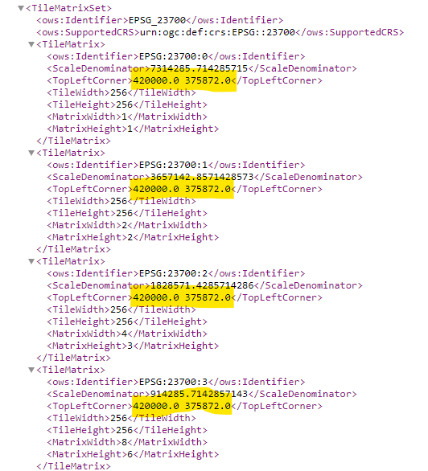
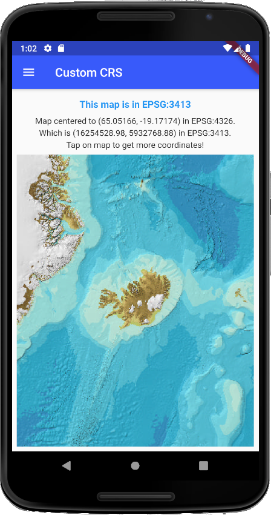

# Custom CRS

## Projection

To define a `Proj4Crs` (custom CRS) you have to register a projection of `proj4.Projection`. For that you must import `proj4dart` library as follows:

```dart
import 'package:proj4dart/proj4dart.dart' as proj4;
```

You can create and register your custom projection in multiple ways, but the recommended is to use a **Proj4 definition string** from [epsg.io](https://epsg.io). For example for `EPSG:3413` (_WGS 84 / NSIDC Sea Ice Polar Stereographic North_) you can find it [here](https://epsg.io/3413.proj4). This is how a Proj4 definition string looks like:

```dart
+proj=stere +lat_0=90 +lat_ts=70 +lon_0=-45 +k=1 +x_0=0 +y_0=0 +datum=WGS84 +units=m +no_defs
```

With this **Proj4 definition string** and a **string identifier** register your `proj4.Projection` like this:

```dart
var customProjection = proj4.Projection.add('EPSG:3413',
        '+proj=stere +lat_0=90 +lat_ts=70 +lon_0=-45 +k=1 +x_0=0 +y_0=0 +datum=WGS84 +units=m +no_defs');
```

For more possible ways to register `proj4.Projection` see [proj4dart documentation](https://github.com/maRci002/proj4dart).

## Coordinate Reference System (CRS)

You can use your previously registered `proj4.Projection` to create a custom CRS of type `Proj4Crs`. You can use the following parameters:

- `<String>` `code` (required): string identifier for the selected CRS, e.g. `EPSG:3413`
- `<proj4.Projection>` `proj4Projection` (required): the `proj4.Projection` object you wish to use
- `<Bounds>` `bounds`: bounds of the CRS in projected coordinates
- `<List<double>>` `resolutions`: an array of zoom factors (projection units per pixel, eg. meters/pixel)
- `<List<double>>` `scales`: scale factors (pixels per projection unit); specify either scales or resolutions, but not both!
- `<List<CustomPoint>>` `origins`: tile origin in projected coordinates (for TileLayer). Why is it needed? GeoServer by default can define different origins (top left coordinates) for each zoom levels. In case of origin mismatch the tile will be drawn on the wrong place: the map will jump at such zoom levels. If your origins vary with zoom levels the number of origins must match the number of resolutions. You can get the desired origins from a `GetCapabilities` WMTS call from geoserver e.g. `http://[ip:port]/geoserver/gwc/service/wmts?request=GetCapabilities`. This results an XML, and you have to look up for the `TopLeftCorner`s for each TileMatrix of your TileMatrixSet.  

- `<Transformation>` `transformation`: the transformation to use when transforming projected coordinates into pixel coordinates

An example:

```dart
var epsg3413 = proj4.Projection.add('EPSG:3413',
    '+proj=stere +lat_0=90 +lat_ts=70 +lon_0=-45 +k=1 +x_0=0 +y_0=0 +datum=WGS84 +units=m +no_defs');

final resolutions = <double>[
  32768,
  16384,
  8192,
  4096,
  2048,
  1024,
  512,
  256,
  128,
];

final epsg3413Bounds = Bounds<double>(
  CustomPoint<double>(-4511619.0, -4511336.0),
  CustomPoint<double>(4510883.0, 4510996.0),
);

var maxZoom = (resolutions.length - 1).toDouble();

var epsg3413CRS = Proj4Crs.fromFactory(
  code: 'EPSG:3413',
  proj4Projection: epsg3413,
  resolutions: resolutions,
  bounds: epsg3413Bounds,
  origins: [CustomPoint(0, 0)],
  scales: null,
  transformation: null,
);
```

## Usage

Proj4Crs has multiple uses:

- Set `FlutterMap`'s default CRS:
  
  ```dart
    FlutterMap(
      options: MapOptions(
        // Set the default CRS
        crs: epsg3413CRS,
        center: LatLng(65.05166470332148, -19.171744826394896),
        zoom: 3.0,
        maxZoom: maxZoom,
      ),
      layers: [],
    );
  ```

- Set a WMS layer's CRS
  
  ```dart
    TileLayerOptions(
      opacity: 1.0,
      backgroundColor: Colors.transparent,
      wmsOptions: WMSTileLayerOptions(
        // Set the WMS layer's CRS
        crs: epsg3413CRS,
        transparent: true,
        format: 'image/jpeg',
        baseUrl:
            'https://www.gebco.net/data_and_products/gebco_web_services/north_polar_view_wms/mapserv?',
        layers: ['gebco_north_polar_view'],
      ),
    );
  ```

For complete code (with point transformation from one projection to another) see the page source code. This is how it looks like:


