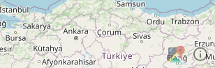
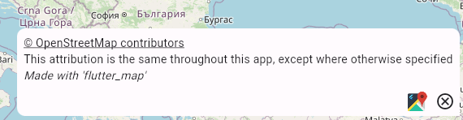
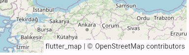

# Attribution Layer

Before publishing your app to users, you should credit any sources you use, according to their Terms of Service.

There are two built in methods to provide attribution, `RichAttributionWidget` and `SimpleAttributionWidget`, but you can also build your own using a simple `Align` widget.


You must comply with the appropriate restrictions and terms of service set by your tile server. Failure to do so may lead to any punishment, at the tile server's discretion.

This library and/or the creator(s) are not responsible for any violations you make using this package.

_The OpenStreetMap Tile Server (as used above) ToS can be_ [_found here_](https://operations.osmfoundation.org/policies/tiles)_. Other servers may have different terms._



Please consider crediting flutter\_map. It helps us to gain more awareness, which helps make this project better for everyone!


## `RichAttributionWidget`



An animated, interactive attribution layer that supports both logos/images (displayed permanently) and text (displayed in a popup controlled by an icon button adjacent to the logos).

It is heavily customizable (in both animation and contents), and designed to easily meet the needs of most ToSs out of the box.

<div align="center">

<figure><figcaption><p>Closed <code>RichAttributionWidget</code></p></figcaption></figure>

 

<figure><figcaption><p>Opened <code>RichAttributionWidget</code>, as in the example app</p></figcaption></figure>

</div>

```dart
children: [
  RichAttributionWidget(
    animationConfig: const ScaleRAWA(), // Or `FadeRAWA` as is default
    attributions: [
      TextSourceAttribution(
        'OpenStreetMap contributors',
        onTap: () => launchUrl(Uri.parse('https://openstreetmap.org/copyright')),
      ),
    ],
  ),
],
```

For more information about configuration and all the many options this supports, see the in-code API documentation.

## `SimpleAttributionWidget`



We also provide a more 'classic' styled box, similar to those found on many web maps. These are less customizable, but might be preferred over `RichAttributionWidget` for maps with limited interactivity.

<figure><figcaption><p><code>SimpleAttributionWidget</code>, as in the example app</p></figcaption></figure>

```dart
children: [
  SimpleAttributionWidget(
    source: Text('OpenStreetMap contributors'),
  ),
],
```
