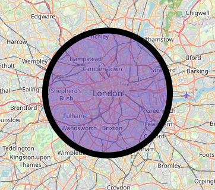

# Circle Layer

You can add circle areas to maps by making them out of a center coordinate and radius using `CircleLayer` and `CircleMarker`s.





<figure><figcaption><p>An example <code>CircleMarker</code></p></figcaption></figure>

```dart
CircleLayer(
  circles: [
    CircleMarker(
      point: LatLng(51.50739215592943, -0.127709825533512),
      radius: 10000,
      useRadiusInMeter: true,
    ),
  ],
),
```


Excessive use of circles may create performance issues.


## Interactivity

`CircleLayer`s and `CircleMarker`s support hit detection and interactivity.


[layer-interactivity](layer-interactivity/)

