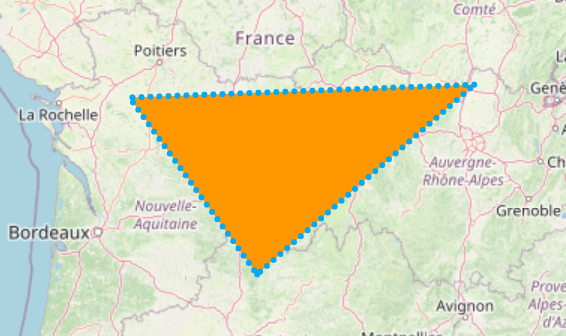

# Polygon Layer

You can add areas/shapes to maps by making them out of individual coordinates using `PolygonLayer` and `Polygon`s.





<figure><figcaption><p>An example <code>Polygon</code></p></figcaption></figure>

```dart
PolygonLayer(
  polygons: [
    Polygon(
      points: [LatLng(30, 40), LatLng(20, 50), LatLng(25, 45)],
      color: Colors.blue,
      isFilled: true,
    ),
  ],
),
```

## Performance Optimizations

### Culling

To improve performance, polygons that are entirely offscreen are effectively removed - they are not processed or painted/rendered. This is enabled by default, and may be disabled using the `polygonCulling` parameter.

### Simplification

To improve performance, polygon outlines (`points`) are 'simplified' before the polygons are culled and painted/rendered. The well-known [Ramer–Douglas–Peucker algorithm](https://en.wikipedia.org/wiki/Ramer%E2%80%93Douglas%E2%80%93Peucker\_algorithm) is used to perform this, and is enabled by default.

> Simplification algorithms reduce the number of points in each line by removing unnecessary points that are 'too close' to other points which create tiny line segements invisible to the eye. This reduces the number of draw calls and strain on the raster/render thread. This should have minimal negative visual impact (high quality), but should drastically improve performance.
>
> For this reason, polygons can be more simplified at lower zoom levels (more zoomed out) and less simplified at higher zoom levels (more zoomed in), where the effect of culling on performance improves and trades-off. This is done by scaling the `simplificationTolerance` parameter (see below) automatically internally based on the zoom level.

To adjust the quality and performance of the simplification, the maximum distance between removable points can be adjusted through the `simplificationTolerance` parameter. Increasing this value (from its default of 0.5) results in a more jagged, less accurate (lower quality) simplification, with improved performance; and vice versa. Many applications use a value in the range 1 - 1.5.

To disable simplification, set `simplificationTolerance` to 0.&#x20;


On layers with (many) only small polygons (those with few points), disabling simplification may yield better performance.



The outline points of holes are not simplified.



Seperate polygons that are usually very close/adjacent/connected to each other on their borders may overlap after simplification, when they did not prior to that.


## Polygon Manipulation

'flutter\_map' doesn't provide any public methods to manipulate polygons, as these would be deemed out of scope.

However, some useful methods can be found in libraries such as 'latlong2' and ['poly\_bool\_dart'](https://github.com/mohammedX6/poly\_bool\_dart). These can be applied to the input of `Polygon`'s `points` argument, and the map will do it's best to try to render them. However, more complex polygons - such as those with holes - may be painted inaccurately, and may therefore require manual adjustment (of `holePointsList`, for example).

## ~~`onTap` Support~~


There is no support for handling taps on polygons, due to multiple technical challenges. To stay up to date with this existing feature request, see the linked issue.



