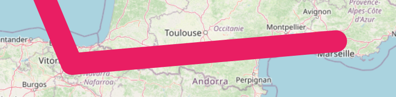

# Polyline Layer

You can add lines to maps by making them out of individual coordinates using `PolylineLayer` and `Polyline`s.





<figure><figcaption><p>An example <code>Polyline</code></p></figcaption></figure>

```dart
PolylineLayer(
  polylines: [
    Polyline(
      points: [LatLng(30, 40), LatLng(20, 50), LatLng(25, 45)],
      color: Colors.blue,
    ),
  ],
),
```

## Interactivity

`PolylineLayer`s and `Polyline`s support hit detection and interactivity.


[layer-interactivity.md](layer-interactivity.md)



If any polylines are very thin, it is recommended for accessibility reasons to increase the size of the 'hitbox' (the area where a hit is detected on a polyline) to larger than the line itself in order to make it easier to tap/interact with the polyline.

The `minimumHitbox` argument adjusts the minimum size of the hitbox - the size of the hitbox will usually be the entire visual area/thickness of the polyline (and border), but will be no less than this value. It defaults to 10.


## Performance Optimizations

### Culling

To improve performance, line segments that are entirely offscreen are effectively removed - they are not processed or painted/rendered. This is enabled by default and disabling it is not recommended.


Polylines that are particularly wide (due to their `strokeWidth`/`borderStrokeWidth` may be improperly culled if using the default configuration. This is because culling decisions are made on the 'infinitely thin line' joining the `points`, not the visible line, for performance reasons.

Therefore, the `cullingMargin` parameter is provided, which effectively increases the distance a segement needs to be from the viewport edges before it can be culled. Increase this value from its default if line segements are visibly disappearing unexpectedly.



Culling cannot be applied to polylines with a gradient fill, as this would cause inconsistent gradients.

These will be automatically internally excluded from culling: it is not necessary to disable it layer-wide - unless all polylines have gradient fills, in which case that may yield better performance.

Avoid using these if performance is of importance. Instead, try using multiple polylines with coarser color differences.


### Simplification

To improve performance, polylines are 'simplified' before being culled and painted/rendered. The well-known [Ramer–Douglas–Peucker algorithm](https://en.wikipedia.org/wiki/Ramer%E2%80%93Douglas%E2%80%93Peucker\_algorithm) is used to perform this, and is enabled by default.

> Simplification algorithms reduce the number of points in each line by removing unnecessary points that are 'too close' to other points which create tiny line segements invisible to the eye. This reduces the number of draw calls and strain on the raster/render thread. This should have minimal negative visual impact (high quality), but should drastically improve performance.
>
> For this reason, polylines can be more simplified at lower zoom levels (more zoomed out) and less simplified at higher zoom levels (more zoomed in), where the effect of culling on performance improves and trades-off. This is done by scaling the `simplificationTolerance` parameter (see below) automatically internally based on the zoom level.


In combination with culling, `PolylineLayer`s with hundreds of thousands of points can be rendered at over 60fps.


To adjust the quality and performance of the simplification, the maximum distance between removable points can be adjusted through the `simplificationTolerance` parameter. Increasing this value (from its default of 0.5) results in a more jagged, less accurate (lower quality) simplification, with improved performance; and vice versa. Many applications use a value in the range 1 - 1.5.

To disable simplification, set `simplificationTolerance` to 0.&#x20;


On layers with (many) only 'short' polylines (those with few points), disabling simplification may yield better performance.


## Routing/Navigation

Routing is out of scope for 'flutter\_map'. However, if you can get a list of coordinates from a 3rd party, then you can use polylines to show them!

Good open source options that can be self-hosted include [OSRM](http://project-osrm.org/) (which includes a public demo server) and [Valhalla](https://github.com/valhalla/valhalla). You can also use a commercial solution such as Mapbox or Google Maps - these can often give more accurate/preferable results because they can use their traffic data when routing.

### Converting Formats

You may have a polyline with 'Google Polyline Encoding' (which is a lossy compression algorithm to convert coordinates into a string and back). These are often returned from routing engines, for example. In this case, you'll need to decode the polyline to the correct format first, before you can use it in a `Polyline`'s `points` argument.

One way to accomplish this is to use another Flutter library called ['google\_polyline\_algorithm'](https://pub.dev/packages/google\_polyline\_algorithm), together with a custom method. You can use the code snippet below, which can just be pasted into a file and imported whenever needed:


```dart
import 'package:latlong2/latlong.dart';
export 'package:google_polyline_algorithm/google_polyline_algorithm.dart'
    show decodePolyline;

extension PolylineExt on List<List<num>> {
  List<LatLng> unpackPolyline() =>
      map((p) => LatLng(p[0].toDouble(), p[1].toDouble())).toList();
}
```


You can then use the package and the above snippet by doing:

```dart
import 'unpack_polyline.dart';

decodePolyline('<encoded-polyline>').unpackPolyline(); // Returns `List<LatLng>` for a map polyline
```
