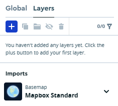

# Using Mapbox


'flutter\_map' is in no way associated or related with Mapbox.

Mapbox's Maps home page: [mapbox.com/maps](https://www.mapbox.com/maps)\
Mapbox's Maps pricing page: [mapbox.com/pricing#maps](https://www.mapbox.com/pricing#maps)\
Mapbox's Maps documentation: [docs.mapbox.com/api/maps/static-tiles](https://docs.mapbox.com/api/maps/static-tiles)


To display their map tiles, Mapbox usually provides a 'Style URL' for map styles. However, to integrate with 3rd-party APIs, they also provide a 'CARTO Integration URL', and tiles requested through this endpoint consume the 'Static Tiles API' quota. This URL needs no extra configuration to integrate with flutter\_map.

The maximum zoom level that Mapbox supports is 22, so it is recommended to set `maxNativeZoom` or `maxZoom` as such.


Attribution is required, see [docs.mapbox.com/help/getting-started/attribution](https://docs.mapbox.com/help/getting-started/attribution/).

Consider using the [#richattributionwidget](../layers/attribution-layer.md#richattributionwidget "mention"), which meets the requirements by supporting both logo and text attribution.


## Integration

### Custom Styles

Mapbox supports creating and using custom styled maps through Studio.


Before attempting to use your style, ensure it actually has layers, and not just a Basemap, which will not appear in the tiles. The image below shows a style which will not work. If you only see blank tiles, but no errors, this is likely the cause.

To create a new style based on the Standard style, choose a template when creating the new style.

 &#x20;


1. Create a custom style using the editor
2. Click "Share...", or the share icon
3. Choose between Draft or Production
4. Scroll to the bottom of the dialog, and choose Third Party
5. Select "CARTO" from the dropdown menu
6. Click the copy button to copy the template URL

<figure><figcaption></figcaption></figure>

#### Configuring [Retina Mode](../layers/tile-layer/#retina-mode)

The URL includes an '@2x' string, which forces usage of high-definition tiles on all displays, without extra setup.

Should you need to let flutter\_map interfere, and only use retina tiles on retina/high-density displays, replace it with the '{r}' placeholder, then see [#retina-mode](../layers/tile-layer/#retina-mode "mention") for more information.

### Prebuilt Styles

Mapbox offers a variety of ready-made map styles that don't require customization. An example URL can be found in [the example here](https://docs.mapbox.com/api/maps/static-tiles/#example-request-retrieve-raster-tiles-from-styles).

This URL should be used as above, although you may need to insert the placeholders manually.
