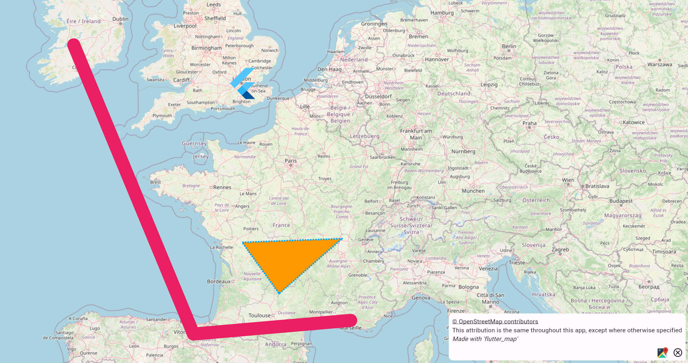

# Layers

To display anything on the map, you'll need to include at least one layer. This is usually a [`TileLayer`](../layers/tile-layer/), which displays the map tiles themselves: without it, the map isn't really a very good map!

<figure><figcaption>
Example <code>FlutterMap</code> widget, containing multiple feature layers, atop a <code>TileLayer</code>
</figcaption></figure>

To insert a layer, add it to the `children` property. Other layers (sometimes referred to as 'feature layers', as they are map features) can then be stacked on top, where the last widget in the `children` list is topmost. For example, you might display a [`MarkerLayer`](../layers/marker-layer.md), or any widget as your own custom layer ([creating-new-layers.md](../plugins/making-a-plugin/creating-new-layers.md "mention"))!


It is possible to add more than one `TileLayer`! Transparency in one layer will reveal the layers underneath.



To display a widget in a sized and positioned box, similar to [overlay-image-layer.md](../layers/overlay-image-layer.md "mention"), try the community maintained [flutter\_map\_polywidget plugin](https://github.com/TimBaumgart/flutter\_map\_polywidget)!


Each layer is isolated from the other layers, and so handles its own independent logic and handling. However, they can access and modify the internal state of the map, as well as respond to changes.

## Hit Testing & Interacitivity


[layer-interactivity](../layers/layer-interactivity/)



[hit-testing-behaviour.md](../layers/layer-interactivity/hit-testing-behaviour.md)


## Mobile vs Static Layers

Most layers are 'mobile', such as the `TileLayer`. These use a `MobileLayerTransformer` widget internally, which enables the layer to properly move and rotate with the map's current camera.

However, some layers are 'static', such as the [`AttributionLayer`](../layers/attribution-layer.md)s. These aren't designed to move nor rotate with the map, and usually make use of a widget like `Align` and/or `SizedBox.expand` to achieve this.

Both of these layer types are defined in the same `children` list. Most of the time, static layers go atop mobile layers, so should be at the end of the list.
