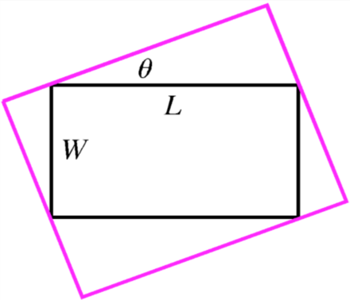

# Options

To dictate & restrict what the map can and should do, regardless of its contents, it needs some guidance!

It provides options that can be categorized into three main parts:

* [#initial-positioning](./#initial-positioning "mention")\
  Defines the location of the map when it is first loaded
* [#permanent-rules](./#permanent-rules "mention")\
  Defines restrictions that last throughout the map's lifetime
* [Event handling](../programmatic-interaction.md#reacting-to-map-events)\
  Defines methods that are called on specific map events



## Initial Positioning


Changing these properties after the map has already been built for the first time will have no effect: they only apply on initialisation.

To control the map programatically, use a `MapController`: [#controller](../programmatic-interaction.md#controller "mention").


By default, the map's north is up. Set the `initialRotation` in degrees to change this if necessary.

To set the geographical location the map should show, choose exactly one of the following options:



The map places the given coordinates at the centre (`initialCenter`), and shows the specified zoom level (`initialZoom`).


Not sure what a zoom level is? In short, zoom level 0 usually displays the whole world in world tile, and a higher zoom level means more zoomed in.

For more information, see [how-does-it-work](../../why-and-how/how-does-it-work/ "mention") and [wiki.openstreetmap.org/wiki/Zoom\_levels](https://wiki.openstreetmap.org/wiki/Zoom_levels).


```dart
MapOptions(
    initialCenter: LatLng(0, 0),
    initialZoom: 13,
    // ...
),
```



The four corners of the map are defined with 1 of 3 possible fitting methods, through `initialCameraFit`.

When the map is not initially rotated, all 3 work the same. When rotated, [#circumscribed-coordinates](./#circumscribed-coordinates "mention") is usually the best choice.



A bounding box is specified, and the map shows the entire area plus any surrounding area necessary (if the map is rotated): `CameraFit.bounds`.

`LatLngBounds` can be constructed with two corners, or automatically constructed from a list of coordinates using the `.fromPoints` constructor.

<div align="center"><figure><figcaption><p>Camera shown in purple<br>Bounding box shown in black<br>North up, camera at an angle</p></figcaption></figure></div>

```dart
MapOptions(
    initialCameraFit: CameraFit.bounds(
        bounds: LatLngBounds(LatLng(10, -10), LatLng(-10, 10)),
    ),
    // ...
),
```



A bounding box is specified, and the map shows only areas which fit inside it: `CameraFit.insideBounds`.

`LatLngBounds` can be constructed with two corners, or automatically constructed from a list of coordinates using the `.fromPoints` constructor.

<div align="center"><figure><figcaption><p>Camera shown in black<br>Bounding box shown in purple<br>North at an angle, camera up</p></figcaption></figure></div>

```dart
MapOptions(
    initialCameraFit: CameraFit.insideBounds(
        bounds: LatLngBounds(LatLng(10, -10), LatLng(-10, 10)),
    ),
    // ...
),
```



A list of coordinates is specified, and the map shows the entire area plus any surrounding area necessary (if the map is rotated): `CameraFit.coordinates`.

Because it is not a bounding box (north-aligned rectangle) being specified unlike the other 2 methods, a rotated map can achieve a tighter fit around the specified coordinates.

```dart
MapOptions(
    initialCameraFit: CameraFit.coordinates(
        coordinates: [
            // ...
        ],
    ),
    // ...
),
```



`CameraFit` also takes a number of other useful parameters, such as `padding` defined in screen-space logical pixels, and more to ensure the map tiles are at their best visual resolution initially. For example:

```dart
CameraFit.bounds(
    // ...
    padding: const EdgeInsets.all(32),
    maxZoom: 16,
    minZoom: 6,
    forceIntegerZoomLevel: true,
),
```



## Permanent Rules

One part of `MapOptions` responsibilities is to define the restrictions and limitations of the map and what users can/cannot do with it.

Some of the options are described elsewhere in this documentation, in context. In addition, the API docs show all the available options, and below is a partial list of options:

* `cameraConstraint`
  * camera bounds inside bounds: `CameraConstraint.bounds`
  * camera center inside bounds: `CameraConstraint.center`
  * _unconstrained (default): `CameraConstraint.unconstrained`_
* `maxZoom` and `minZoom`\
  Sets a hard limit on the maximum and minimum amounts that the map can be zoomed
* [`interactionOptions`](interaction-options.md)\
  Configures the gestures that the user can use to interact with the map - for example, disable rotation or configure cursor/keyboard rotation


Instead of `maxZoom` (or in addition to), consider setting `maxNativeZoom` per `TileLayer` instead, to allow tiles to scale (and lose quality) on the final zoom level, instead of setting a hard limit.


## Custom CRS

FM does have some support for using alternative CRSs.&#x20;


[custom-crss.md](custom-crss.md)


## Keep Alive

If the map is built lazily, for example in a `PageView`, loading and unloading the map will cause it to reset.

To prevent this, set `MapOptions.keepAlive` to `true`, which will activate an internal `AutomaticKeepAliveClientMixin`.
